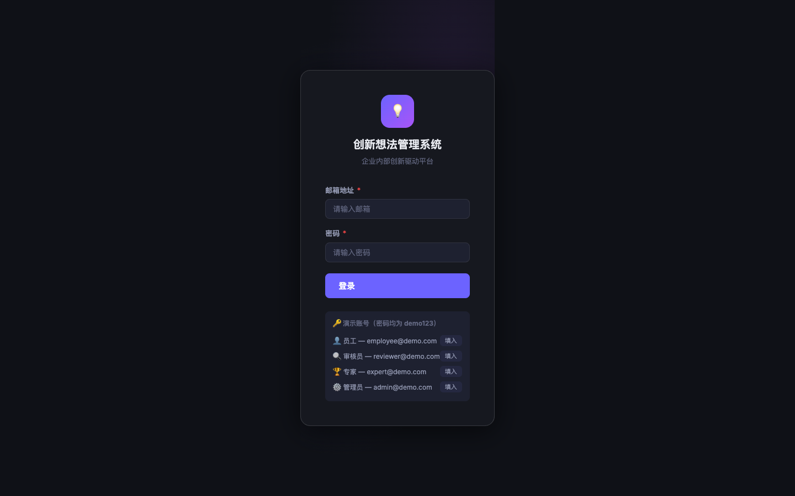
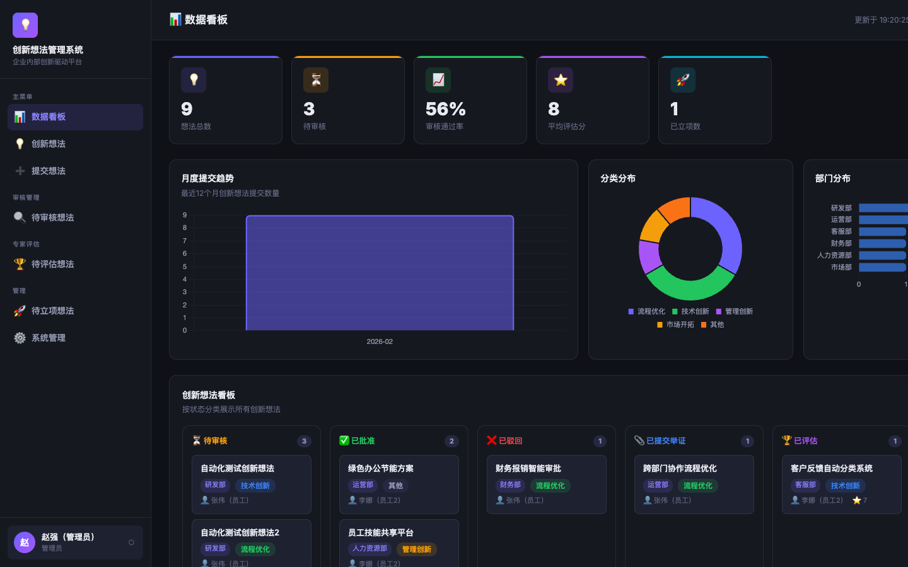
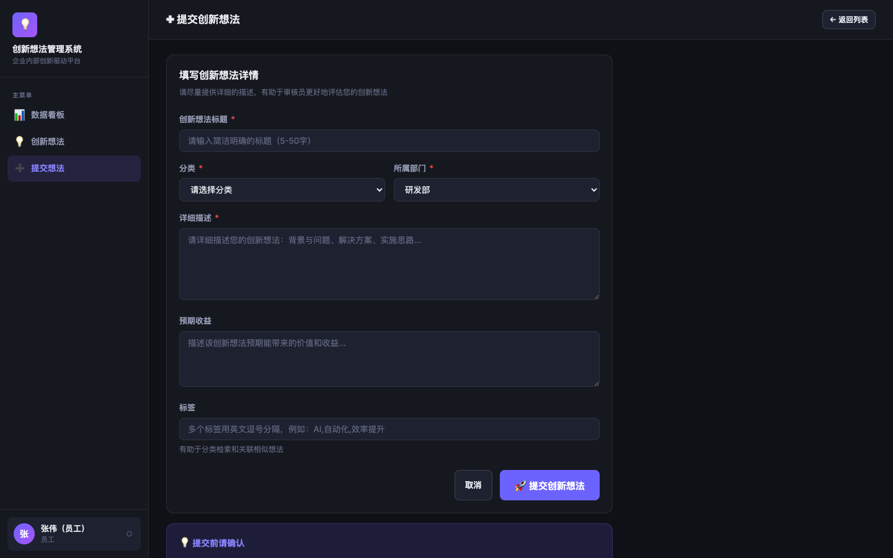
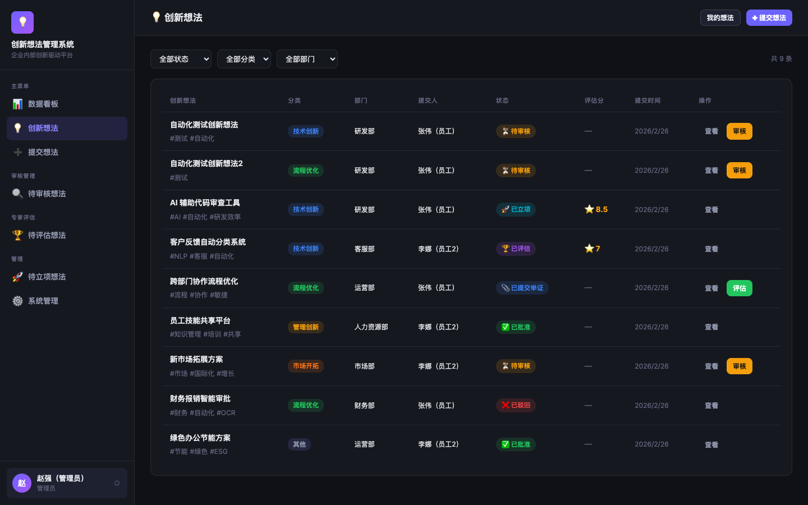

# 创新想法管理系统 (Innovation Management System)

企业内部创新驱动平台 — 支持创新想法的提交、审核、举证、专家评估和项目立项全流程管理。

## 快速启动

### 1. 前置要求
- **Node.js**环境（建议版本 v18+ 或 LTS版）

如果你尚未安装 Node.js，可以前往 [nodejs.org](https://nodejs.org/) 下载安装，或者使用你系统的包管理器（如针对 macOS 的 `brew install node`）。

### 2. 获取代码与安装依赖

将本项目代码放置在你本地的任意目录下，然后通过命令行进入项目根目录：

```bash
cd path/to/innovation-system   # 替换为你实际存放项目的目录路径
```

安装运行所需的所有依赖库：

```bash
npm install
```

> **系统主要依赖说明：**
> - **`express`** (^4.18.2): Web 应用框架体系
> - **`better-sqlite3`** (^12.6.2): 同步且高性能的 SQLite 数据库驱动（系统启动时会自动生成数据库文件，无需额外部署数据库服务器）
> - **`express-session`** & **`bcryptjs`**: 用于会话状态保持和登录密码的安全哈希验证
> - **`multer`** (^1.4.5): 用于处理 `multipart/form-data` 以支持用户上传举证相关的附件资料
> - **`uuid`**: 辅助生成全局唯一标识符工具

### 3. 启动服务器

保持在项目根目录下，运行以下命令启动系统主入口：

```bash
npm start
```

*如果你用于调试开发，也可以使用 `npm run dev` 命令。*

启动成功后，在浏览器访问系统地址：
👉 **http://localhost:3000** （默认端口 3000，或可通过环境变量 `PORT` 指定）

---

## 系统界面预览

### 1. 登录界面


### 2. 数据看板 (管理员视图)


### 3. 提交创新想法 (员工视图)


### 4. 想法状态流转看板


### 5. 想法详情与多阶段评审


---

## 演示账号与权限体系

系统出厂时自动内置（Seed）了全角色生命周期的演示账号，**所有演示账号的密码统一为**：`demo123`。

| 角色 | 演示登录邮箱 | 系统职责权限 |
|------|------|------|
| **员工** | `employee@demo.com` | 提交新的创新想法、在想法被批准后进一步上传执行的原始**举证材料**、查看流程进展。 |
| **审核员** | `reviewer@demo.com` | 负责初步**审核**待提交的想法，填写初审与可行性意见（批准/驳回）。 |
| **专家** | `expert@demo.com` | 针对已经提供有效举证的项目进行多维度**打分评估**（1-10分），并向管理层给出“是否推荐立项”的最终判断。 |
| **管理员** | `admin@demo.com` | 获取“待立项”面板权限进行预算与周期的**确认立项**；同时具有系统最高权限用于用户和部门的基础信息管理（增删查改）。 |

---

## 核心业务：工作流流转状态机

系统的核心设计是通过各类角色的协作，将一条普通的 idea 一步步落地为真实项目。完整生命周期节点如下：

```
1. [等待审核] (pending_review) : 员工提交初始想法
      ↓
2. [已批准] (approved) : 审核员判定想法具有尝试价值
      ↓
3. [已提交举证] (evidence_submitted) : 员工在小规模验证后上传了测试数据/执行凭证
      ↓
4. [已评估] (evaluated) : 专家团队介入打分完毕并流转评价结论
      ↓ (如专家强烈推荐)
5. [待立项] (project_pending) : 送递管理层进行最终立项决策
      ↓
6. [已立项] (project_established) : 管理员分配资金、时间节点和项目负责人，转化为正式项目
```

*(业务流中支持被驳回（rejected / evaluation_rejected）的情况进入停止状态。)*

## 数据看板与统计

登录后进入 `Dashboard` 数据看板，系统提供以下统计维度（集成 `Chart.js`）：
- **KPI 指标卡**：总想法数、待审核数、整体审核通过率、平均评估分、成功立项数
- **趋势分析**：最近12个月想法提交势头情况（折线图/柱状图形式）
- **维度占比**：各创新分类（如“技术创新”、“管理优化”等）饼图与各部门立项产出比例
- **交互看板（Kanban Board）**：直观展示位于所有流转生命周期节点上的想法卡片群列。

---

## 目录结构说明

```
innovation-system/
├── package.json       # 项目依赖与脚本配置
├── server.js          # 系统 Express.js 主启动入口
├── database.js        # 数据库初始化脚本（含表结构创建与默认数据 Seed）
├── /routes            # API 业务路由层
│   ├── auth.js          (登录校验与会话分发)
│   ├── ideas.js         (全周期想法流转管理)
│   ├── reviews.js       (审核员动作处理)
│   ├── evidences.js     (处理文件留存动作)
│   ├── evaluations.js   (处理专家评分逻辑)
│   ├── projects.js      (处理立项生成逻辑)
│   └── dashboard.js/admin.js/departments.js (业务报表与系统底座管理)
├── /middleware        # 包含角色权限拦截守卫 middlewares
├── /public            # 原生交互前端（零构建依赖）
│   ├── *.html           (HTML页面及自带的前端控制逻辑)
│   ├── /css/main.css    (全局样式、组件映射体系)
│   └── /js/api.js       (共用 Fetch 封装器及前端响应拦截器)
└── /uploads           # 【动态建立】用户资料、举证附近安全存放区
```
